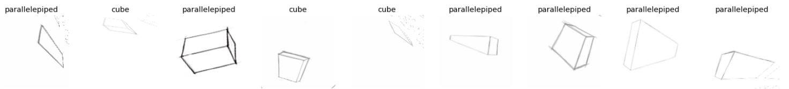
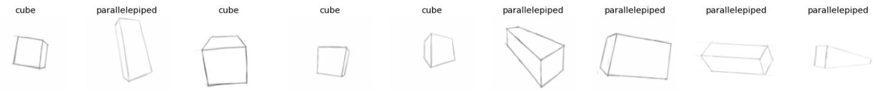
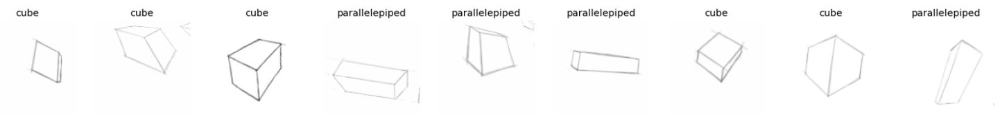
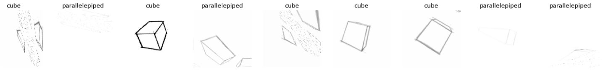

# MongeNET
Transfer Learning and Data Augmentation Techniques for Sketch Recognition

Link to the Partial Dataset for experimentation [here](https://cdesigninstitute-my.sharepoint.com/:f:/g/personal/alberto_tono_cd_institute/EjRNlDaspmZMjIQ5rvf7t7wBRHipWUDcnsg5yqaxIalcQw?e=IeARKL)

This is a quick POC to show how in 10min and with only few images you can have a classifier capable to distinguish different solids with simple Transfer Learning and Data Augmentation in FastAI
